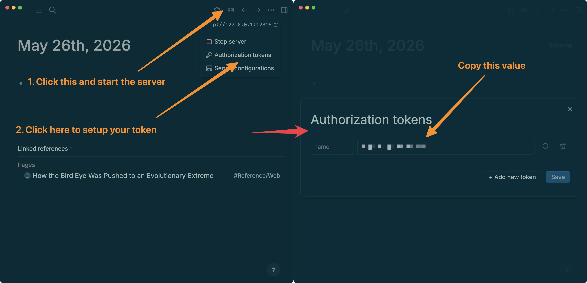
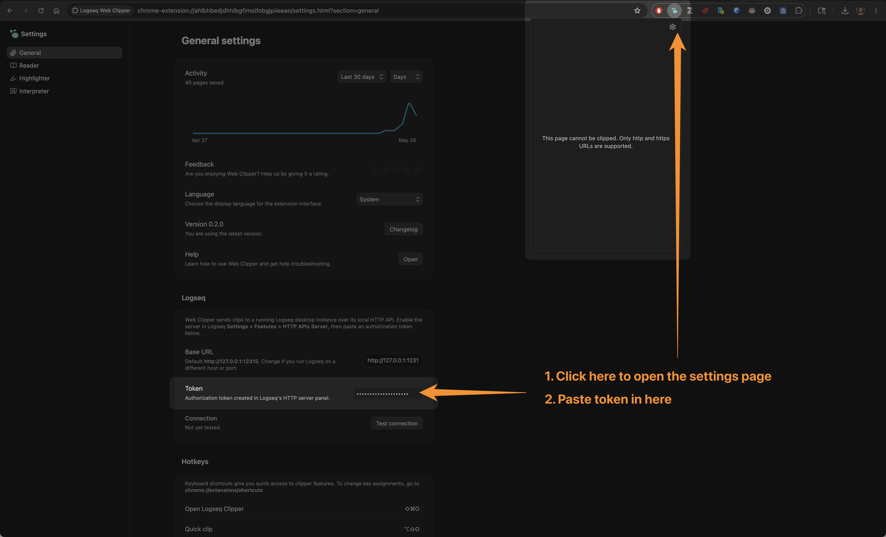
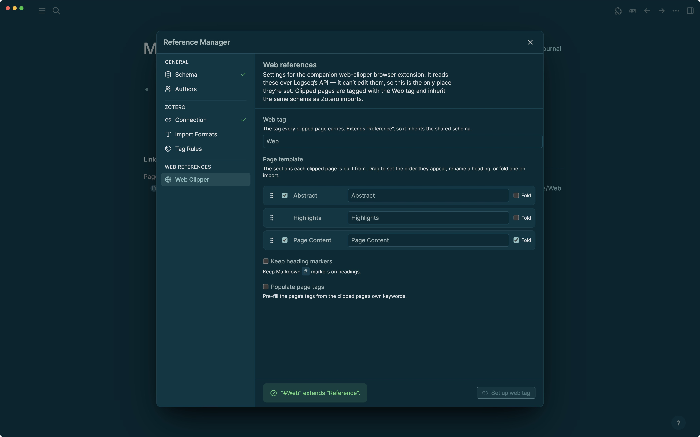

# Logseq Web Clipper

Based on the incredible [Obsidian Clipper](https://obsidian.md/clipper), a tool to highlight, annotate, and save web pages into your Logseq graph. 

Targets the **DB graph** version of Logseq only. Talks to Logseq via its local HTTP API on `http://127.0.0.1:12315`.


## Install

### Chrome Extension

Distributed outside the Chrome Web Store, so it installs in **developer mode**:

1. Download the [latest release](https://github.com/rsomani95/logseq-web-clipper/releases) and unzip it.
2. Open `chrome://extensions` and turn on **Developer mode** (top-right).
3. Click **Load unpacked** and select the unzipped folder.

There's no auto-update for developer-mode extensions — to upgrade, download the new zip and repeat.

### Logseq Setup

Needs the [`logseq-reference-manager`](https://github.com/rsomani95/logseq-reference-manager) plugin to setup the tag + properties to enable import. See that project's README for getting the Logseq side set up.

Additionally, you'll need to start the HTTP server from Logseq, create a token, and paste that in the extension's settings:


Then, click on the extension's icon and go to the settings, and paste it in here:


## Configuration

We enable 3 main features:
- Capture page content
- Highlight
- Take notes while reading

All of these get imported into the Logseq page at import time. You can customise the names of the blocks, whether or not you want to pre-fill tags from the page, formatting of the headings, tag name, and whether or not to copy over page content in the `logseq-reference-manager` settings:



## Develop

You'll need to do the Logseq setup as described above.

```bash
# Install workspace deps once
bun install

# Extension (webpack, watch mode)
npm run dev:chrome
# → dev/ — load as unpacked in chrome://extensions
```

## Architecture

The extension does all the clipping and talks to Logseq over the local HTTP API.

At save time the extension discovers which properties the clip tag carries (its own + everything inherited via class `extends`) in one datascript query, matches each field by display title to a real `:db/ident`, and writes to it. Sharing the provider's namespace (today `:plugin.property.logseq-reference-manager/*`) means `#Web` pages and the provider's other reference pages (e.g. Zotero imports) carry the same property entities — so queries union and URL dedupe spans both.

Configuration is one-directional too: the capture settings — the clip tag, whether to capture page content — live in the plugin's own settings UI, and the extension reads them from Logseq over the HTTP API at runtime. It can't write them back, so editing happens only in the plugin. The one exception is the connection settings (Logseq's base URL and API token), which stay in the extension — they're what it needs to reach Logseq in the first place.


PS: The `docs/` are out of date and still reflect the original implementation of the Obsidian Web Clipper, and none of the changes made here.
